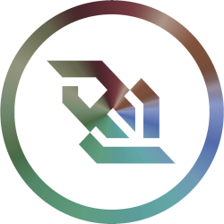

<!-- PROJECT SHIELDS -->
<!--
*** I'm using markdown "reference style" links for readability.
*** Reference links are enclosed in brackets [ ] instead of parentheses ( ).
*** See the bottom of this document for the declaration of the reference variables
*** for contributors-url, forks-url, etc.
-->
<div align="left">

[![Contributors][contributors-shield]][contributors-url]
[![Forks][forks-shield]][forks-url] [![Stargazers][stars-shield]][stars-url]

</div>

<a href="#">
  
</a>

<div align="left">
  <h1><em>RT-DashTwo</em></h1>
</div>

**RT-DashTwo** is a real-time robotics dashboard built with [Next.js](https://nextjs.org/), [Three.js](https://threejs.org/), and WebSockets to visualize IMU data, odometry, and sensor fusion outputs from an ESP32-based embedded system.  
It uses [D3.js](https://d3js.org/) for plotting, [Tailwind CSS](https://tailwindcss.com/) for styling, and [TypeScript](https://www.typescriptlang.org/) for type safety.


### Built With

<a href="https://nextjs.org/" target="__blank"></a><a href="https://react.dev/" target="__blank"></a><a href="https://www.typescriptlang.org/" target="__blank"></a><a href="https://threejs.org/" target="__blank"></a>
<a href="https://d3js.org/" target="__blank"></a><a href="https://tailwindcss.com/" target="__blank"></a><a href="https://nodejs.org/" target="__blank"></a><a href="https://developer.mozilla.org/en-US/docs/Web/API/WebSockets_API" target="__blank"></a>


<!-- GETTING STARTED -->
## Getting Started

To get a local copy of the project up and running on your machine, follow these steps:

### Prerequisites

- [Node.js](https://nodejs.org/) (v18+ recommended)
- npm or pnpm
- ESP32 firmware configured to stream data via WebSockets

### Installation

1. Clone the repo
```sh
   git clone https://github.com/ymiuraaa/rtdashtwo.git
   cd rtdashtwo
```

2. Install dependencies

```sh
   npm install
```

3. Run the dashboard

```sh
   npm run dev
```

---

## Usage

* Visit `http://localhost:3000` or your LAN IP (e.g., `http://192.168.1.xxx:3000`)
* ESP32 connects to WebSocket at `ws://<LAN_IP>:8080`
* Dashboard will show live IMU, odometry, and 3D model orientation

---

## Project Structure (tentative but graphs and imu probably won't change for a while)

```sh
src
└── app
    ├── globals.css
    ├── layout.tsx
    └── page.tsx
components
├── graphs
│   ├── colors.ts
│   ├── index.tsx
│   └── types.ts
├── imu
│   ├── ImuViewerCard.tsx
│   └── ThreeImuViewer.tsx
├── odometry
│   ├── OdometryPlot.tsx
│   └── index.tsx
├── motors
│   ├── PwmPlot.tsx
│   └── index.tsx
├── ui
│   ├── button.tsx
│   ├── card.tsx
│   └── input.tsx
├── Header.tsx
└── useDynamicChartOptions.tsx
LICENSE
package.json
package-lock.json
postcss.config.mjs
README.md
socket-server.js
tailwind.config.ts
```

---
<!-- License -->
## License

This project is licensed under the **GNU General Public License v3.0**.
You may:

* Use, modify, and distribute the software **with attribution**.
* Contribute improvements, which must also be open-sourced under GPL-3.0.
* Not use the software for proprietary/closed-source purposes.

See [`LICENSE`](./LICENSE) for details.

---

[contributors-shield]: https://img.shields.io/github/contributors/ymiuraaa/rtdashtwo.svg?style=for-the-badge
[contributors-url]: https://github.com/ymiuraaa/rtdashtwo/graphs/contributors
[forks-shield]: https://img.shields.io/github/forks/ymiuraaa/rtdashtwo.svg?style=for-the-badge
[forks-url]: https://github.com/ymiuraaa/rtdashtwo/network/members
[stars-shield]: https://img.shields.io/github/stars/ymiuraaa/rtdashtwo.svg?style=for-the-badge
[stars-url]: https://github.com/ymiuraaa/rtdashtwo/stargazers